## 🏢 Alura Store: Análise de Desempenho das Lojas

Este repositório apresenta uma análise exploratória do desempenho de quatro lojas da Alura Store, com o objetivo de identificar oportunidades para venda de uma unidade e investimento em um novo negócio.

### 🎯Objetivo principal

Comparar o desempenho das 4 lojas utilizando indicadores relevantes para embasar a decisão estratégica de venda e investimento.

### Estrutura do Projeto 

- **`data`**: Dados brutos das lojas.
- **`graphics`**: Visualizações gráficas da análise.
- **`notebook`**:  Código Python (Jupyter Notebook) para análise e geração de gráficos.
- **`readme.md`**: Documentação do projeto (este arquivo).

### Principais Análises Realizadas:

1.  **`Faturamento total de cada loja `**: Análise comparativa do faturamento total de cada loja.

2.  **`Vendas por categoria`**: Distribuição das vendas por categorias de produtos em cada loja.

3.  **`Media de avaliacao lojas`**:  Comparativo da satisfação dos clientes em cada loja.

4.  **`Produtos mais e menos vendidos`**:  Identificação dos produtos de melhor e pior desempenho em cada loja.

5.  **`Frete médio por loja`**: Custo médio de envio por loja.

6.  **`Analise desempenho geografico`**: Análise da distribuição geográfica das vendas e mapas de calor da intensidade de vendas por região.


### ⚙ Etapas para executar o código:

Baixe ou clone o projeto no Github caso for usar em alguma IDE.

1.  Clone este repositório:
    ```bash
    git clone [https://github.com/dfarneym/AluraStore_Challenge](https://github.com/dfarneym/AluraStore_Challenge)
    ```
2.  Navegue até o diretório do projeto:
    ```bash
    cd [nome do seu repositório]
    ```
3.  Certifique-se de ter as bibliotecas necessárias instaladas. Você pode instalar as dependências usando o pip:
    ```bash
    pip install pandas matplotlib numpy folium
    ```
4.  Execute o Jupyter Notebook:
    ```bash
    jupyter notebook
    ```
5.  Abra os notebooks (`.ipynb`) desejados no seu navegador e execute as células para visualizar as análises e os gráficos.

### 🛠️Ferramentas utilizadas:

Para executar o notebook você precisará ter:
 - Google Colab
 - Python 
 - Bibliotecas:
   - Pandas
   - Matplotlib
   - Numpy
   - folium

### 📊Gráficos e Insights

* **Faturamento Mensal**: Ao observar o faturamento total, percebi que a Loja 1 é a que mais fatura, com um valor de R\$1.534.509,12. Em contraste, a Loja 4 é a que menos fatura, com R\$1.384.497,58. Isso nos mostra que a Loja 1 gera mais receita em comparação com as outras.

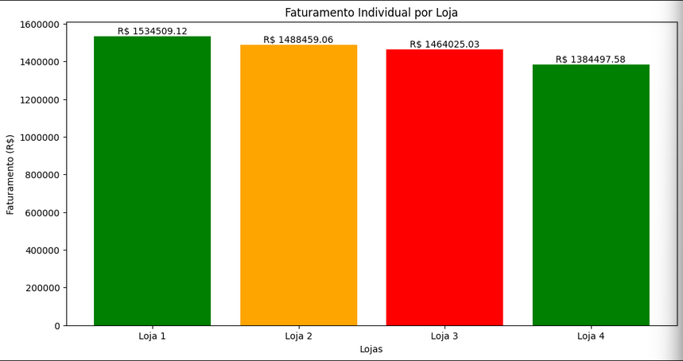

* **Participação de Vendas por Categoria**: Analisando as categorias de produtos, notei que os "Eletrônicos" são os itens mais vendidos em todas as lojas. Por outro lado, categorias como "Livros", "Utilidades Domésticas" e "Brinquedos" vendem menos. Essa informação é útil para entender o interesse dos clientes em cada tipo de produto por loja.

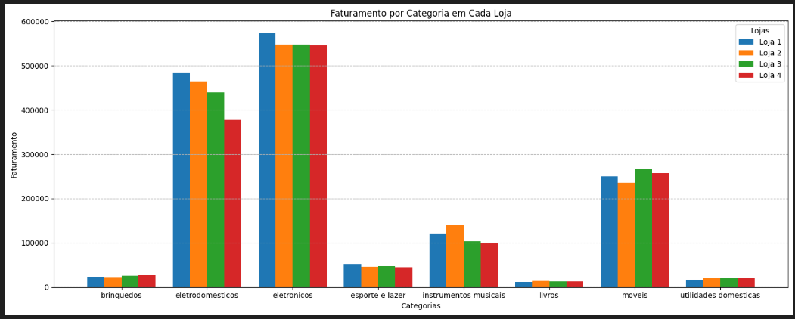

* **Média de Avaliação das Lojas**: Ao analisar a média de avaliação dos clientes, a Loja 3 se destaca com a melhor nota (4.04), indicando que os clientes estão mais satisfeitos com essa loja. A Loja 1 tem a pior avaliação (3.97), sugerindo que pode haver pontos a serem melhorados na experiência do cliente desta unidade.

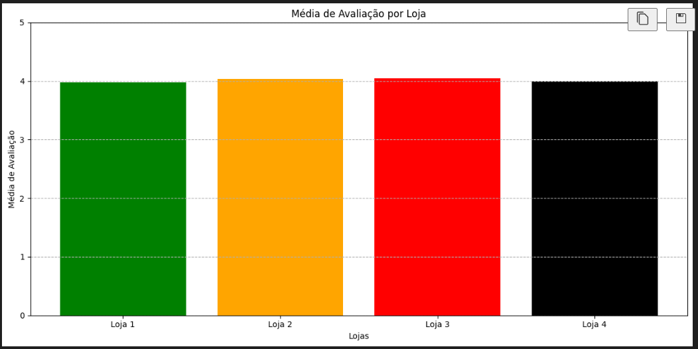

* **Produtos Mais e Menos Vendidos**: Foi identificado que o produto "Livro Iniciando em Programação" é o campeão de vendas na Loja 2, com 223 unidades vendidas. Já o produto menos vendido é o "Celular ABXY" na Loja 1, com apenas 78 unidades vendidas. Essa análise ajuda a entender a popularidade de produtos específicos em cada loja.

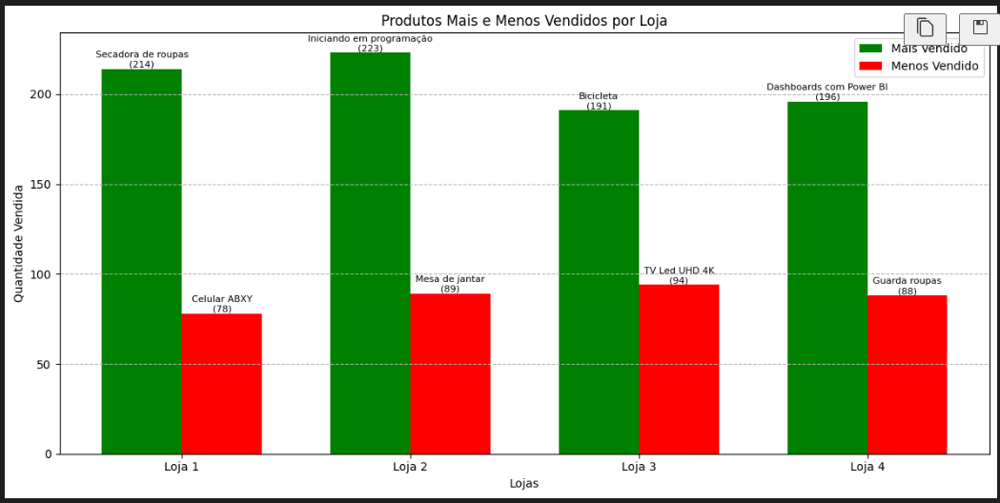

* **Frete Médio por Loja**: Ao analisar o custo médio de frete, a Loja 1 apresenta o maior valor (R$34.69), o que pode impactar a competitividade dos preços dos produtos. A Loja 4 tem o menor custo médio de frete (R\$31.27), o que pode ser um ponto positivo para atrair clientes sensíveis ao preço da entrega.

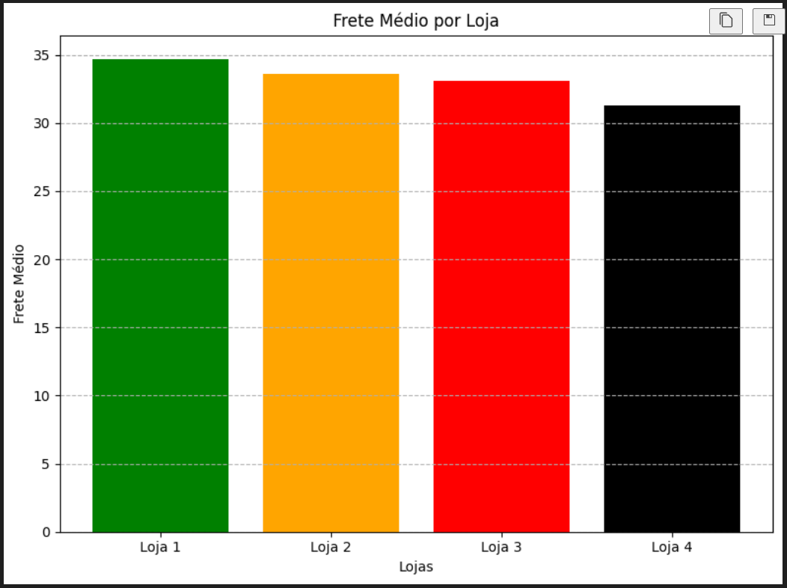

* **Análise de Desempenho Geográfico**: Através dos gráficos de dispersão, podemos visualizar onde cada loja realiza mais vendas. Áreas com muitos pontos ou cores mais intensas no mapa de calor indicam uma alta concentração de vendas. Essa análise ajuda a entender a área de influência de cada loja e se há sobreposição de atuação entre elas.

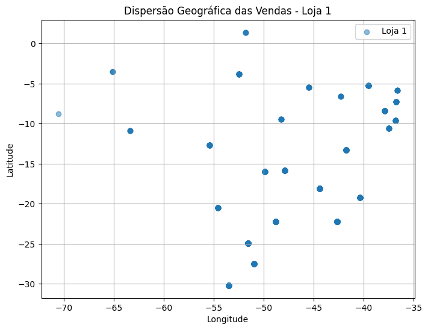

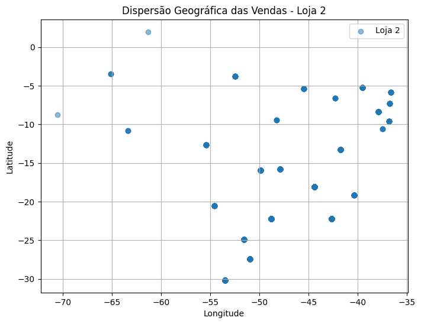

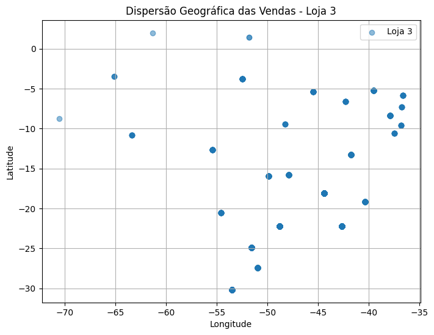

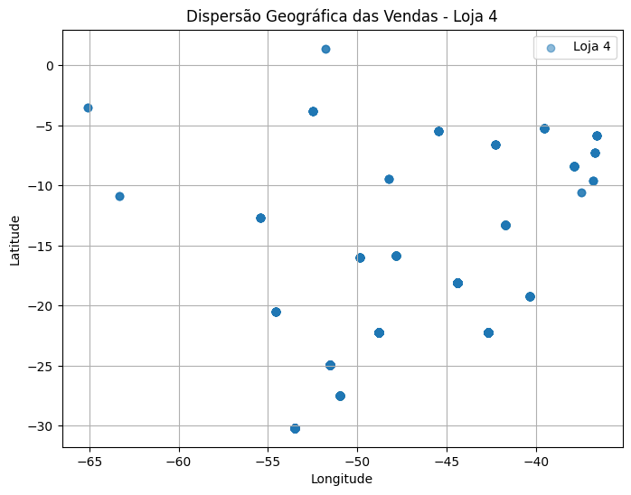

* 🌞**Mapa de calor**: No mapa de calor podemos visualisar a intensidade das vendas de cada loja em diferentes áreas geográficas como:
    - Áreas Quentes: Regiões com cores mais intensas (geralmente vermelho ou laranja) indicam uma alta concentração de vendas.
    - Áreas Frias: Regiões com cores mais claras (geralmente azul ou verde) indicam uma baixa concentração de vendas.
    - Comparação entre Lojas: Ao visualizar os mapas de calor de diferentes lojas, você pode identificar se algumas lojas têm um desempenho melhor em certas áreas geográficas.

  - Mapa de calor Loja 1
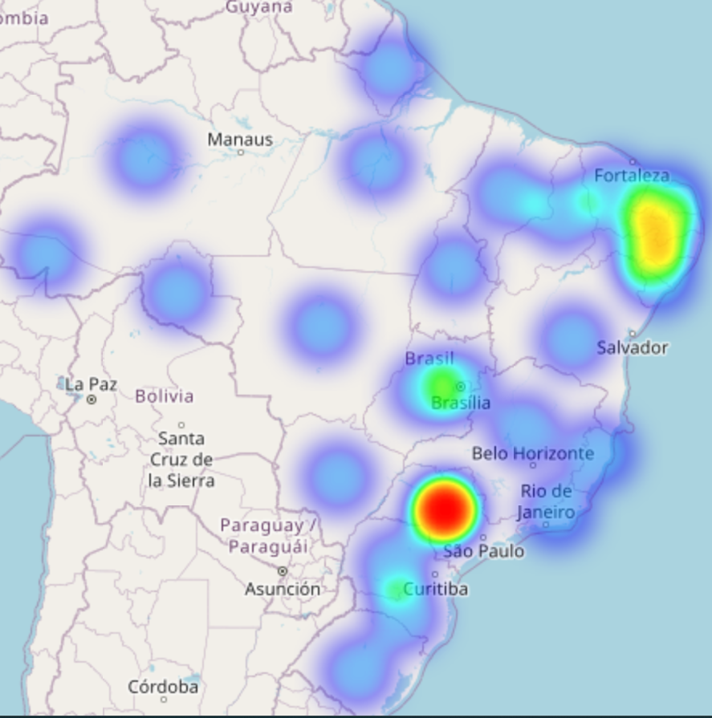
  - Mapa de calor Loja 2
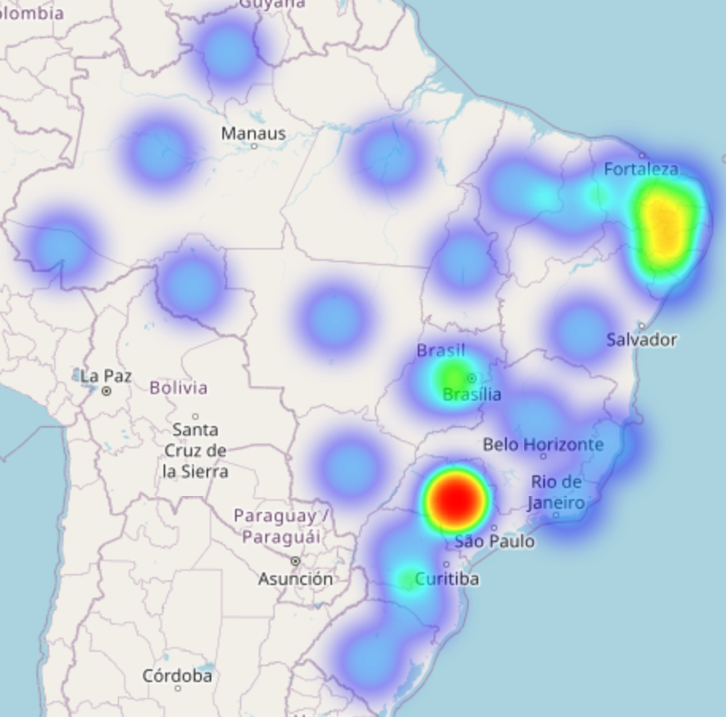
  - Mapa de calor Loja 3
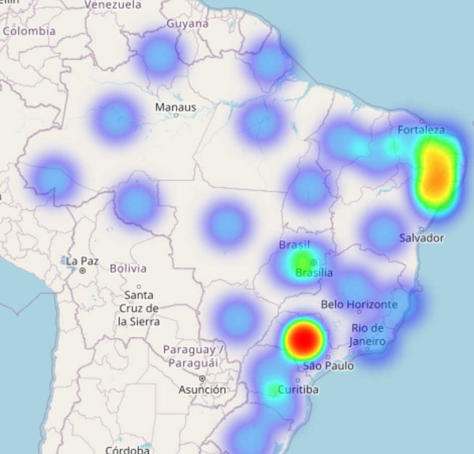
  - Mapa de calor Loja 4
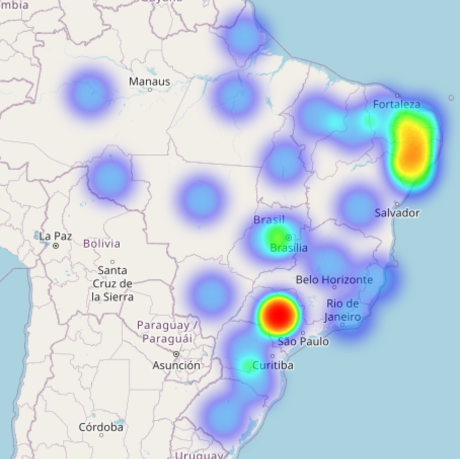

### 🤝 Indicação de Loja para venda:
Considerando os dados apresentados, a Loja 4 se destaca como uma potencial candidata para venda. Embora seu custo de frete seja o menor, ela apresenta o menor faturamento total em comparação com as outras lojas. Além disso, sua avaliação não é a pior, mas também não é a melhor, ficando atrás da Loja 3.

A venda da Loja 4 permitiria focar os recursos e investimentos nas lojas com melhor desempenho de faturamento (como a Loja 1) e alta satisfação do cliente (como a Loja 3), além de possibilitar o investimento em um novo negócio, conforme o objetivo inicial. É importante, no entanto, realizar uma análise mais aprofundada dos custos operacionais, margens de lucro e outros fatores antes de tomar uma decisão definitiva.

### 🚀Conclusão

A análise exploratória forneceu insights valiosos sobre o desempenho das quatro lojas da Alura Store. A Loja 1 lidera em faturamento, mas a Loja 3 se destaca na satisfação do cliente. A Loja 4, com o menor faturamento, surge como uma possível opção para venda, permitindo um realinhamento estratégico dos investimentos. A decisão final deve ser embasada em uma análise mais completa, considerando todos os aspectos financeiros e operacionais do negócio.